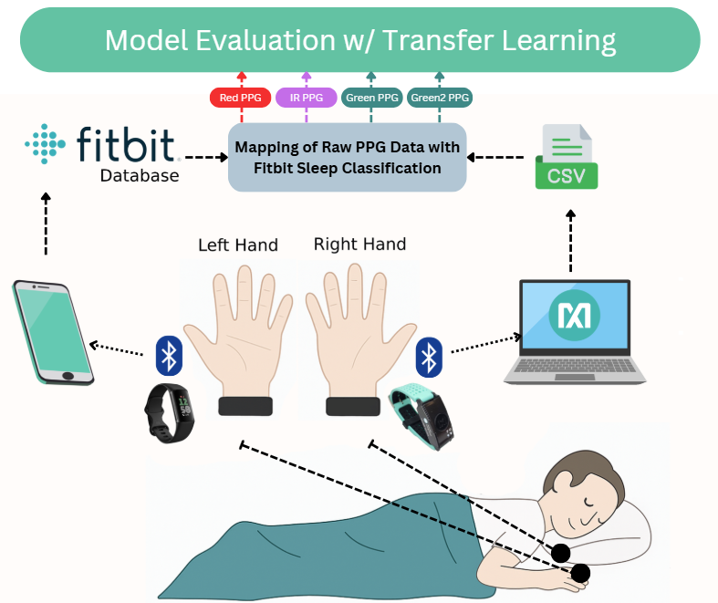
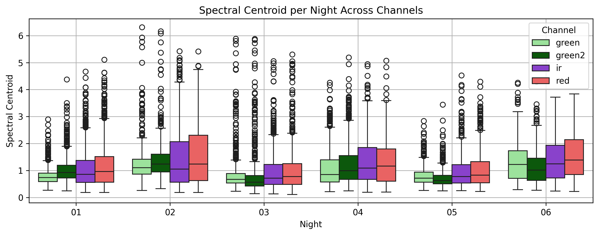

# Cross-Sensor Transferability of a Deep Residual U-Net for Sleep Staging Using Temporal Low-Frequency Photoplethysmography

**Authors**: Neil Joshua Limbaga*, Haozheng He*, José Ilton de Oliveira Filho*, Khaled Nabil Salama*  
*King Abdullah University of Science and Technology (KAUST), Thuwal, Saudi Arabia  

---

### Citation

If you use this dataset or protocol, please cite the following publication:

> N. J. Limbaga, H. He, J. I. de Oliveira Filho, and K. N. Salama,  
> “Cross-Sensor Transferability of a Deep Residual U-Net for Sleep Staging Using Temporal Low-Frequency Photoplethysmography,”  
> *IEEE Sensors Letters*, vol. 9, no. 8, Aug. 2025,
> DOI: [10.1109/LSENS.2025.3589877](https://doi.org/10.1109/LSENS.2025.3589877)

---

This repository contains the dataset and experimental protocol used in the IEEE Sensors Letters submission titled:  
**"Cross-Sensor Transferability of a Deep Residual U-Net for Sleep Staging Using Temporal Low-Frequency Photoplethysmography"**.

The study evaluates a Residual U-Net architecture trained on the public MESA dataset and transferred to a private low-frequency PPG dataset collected across six nights from a single subject using MAX86141 and Fitbit Charge 6 devices. The data demonstrates intra-subject signal variability and provides a reproducible protocol for cross-sensor transfer learning evaluation.

## Dataset Summary

| Prefix | Date         | Raw Sensor | Ground Truth      | Light | Deep | REM | 
|--------|--------------|------------|-------------------|-------|------|-----|
| 01     | 07-13-2024   | MAX86141   | Fitbit Charge 6   | 1613  | 408  | 588 |
| 02     | 08-20-2024   | MAX86141   | Fitbit Charge 6   | 1371  | 252  | 255 | 
| 03     | 11-10-2024   | MAX86141   | Fitbit Charge 6   | 900   | 273  | 426 | 
| 04     | 03-13-2025   | MAX86141   | Fitbit Charge 6   | 1020  | 393  | 423 | 
| 05     | 03-16-2025   | MAX86141   | Fitbit Charge 6   | 706   | 258  | 285 |
| 06     | 03-18-2025   | MAX86141   | Fitbit Charge 6   | 735   | 270  | 234 | 

Each label corresponds to a 30-second window, and duration was computed accordingly.

## Experimental Protocol

  
*Figure: MAXREFDES103 and Fitbit Charge 6 setup, synchronized via timestamp alignment. Raw PPG signals were collected from MAX86141 and matched with Fitbit-derived sleep stage labels.*

- **Sensor**: MAX86141 (Green, Green2, IR, Red)
- **Sampling Rate**: 10 Hz
- **Label Source**: Fitbit Charge 6 (via timestamp mapping)
- **Sleep Staging**: 3-class (Light, Deep, REM)
- **Preprocessing**: 90s window with 30s stride, z-score normalization
- **Training Strategy**: Transfer learning using frozen encoder layers

## Spectral Centroid Analysis

To justify intra-subject variability across the six nights, we computed the spectral centroid for each normalized PPG window. Variations in the centroid values highlight distinct frequency distributions across nights and wavelengths, confirming the need for sensor-specific adaptation even in a single individual.

  
*Figure: Spectral Centroid per Night across PPG Channels (Green, Green2, Red, IR).*

---

## 📁 Contents

- `/green` – Raw Green PPG and label pickle files (6 nights)
- `/green2` – Raw Green2 PPG and label pickle files (6 nights)
- `/ir` – Raw Infrared PPG and label pickle files (6 nights)
- `/red` – Raw Red PPG and label pickle files (6 nights)
- `/figures` – Figures used in the publication

---

